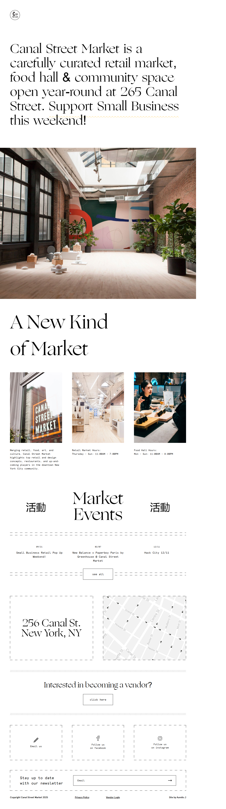
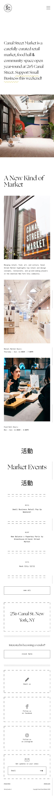

# Canal Street Market Landing Page Clon

Clon responsivo de la landing page del sitio oficial de [Canal Street Market](https://canalstreet.market/), realizado como proyecto personal a fines de practicar diseño web moderno con React, Vite y Tailwind CSS.

## Demo

[Ver Demo en vivo](https://canalstreetmarketclone.netlify.app/)

## Capturas

### Versión de escritorio


### Versión móvil


## Tecnologías usadas

- [Vite](https://vitejs.dev/)
- [React](https://react.dev/)
- [Tailwind CSS](https://tailwindcss.com/)

## Características

- Clon visualmente fiel a la landing page original
- Diseño responsivo
- Código limpio y organizado

## Instalación

1. Cloná el repositorio:

```bash
git clone https://github.com/WalterAurelio/canalsm-homepage-clon.git
```

2. Ingresá a la carpeta del proyecto:

```bash
cd canalsm_homepage_clon
```

3. Instalá las dependencias:

```bash
npm install
```

4. Iniciá el servidor de desarrollo:

```bash
npm run dev
```

## Autor

- [Aurelio Gareca](https://github.com/WalterAurelio)

---

Proyecto creado únicamente con fines educativos. No afiliado con el sitio original.